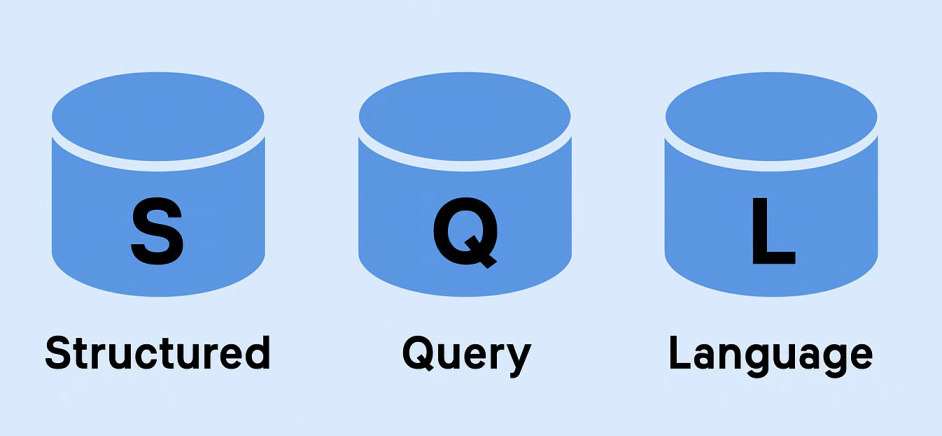

# Database Systems (CS305) Lab 1 Assignment

Installing Software and Exploring database technologies

**Assigned** : 2nd September 2025

**Due** : 9th September 2025

## Objectives

+ To gain experience installing software which is necessary for the course
+ To practice using `git` to clone repositories and to submit homeworks from local machines
+ To gain perspective about different types of technologies / softwares which complete database tasks

## Part 1

### Docker

Docker is a software that creates virtual machines on a local machine. For instance, if you are using Windows and require Unix commands and software to complete tasks, then Docker could be used to create a working virtual Unix machine on your local machine to enable to you work in a Unix environment.

In this course, we will be using commands which were designed to work on MacOS and Linux. Unfortunately, these commands are not likely to work on a Windows machine. It is therefore important to install Docker if your machine OS is Windows. Note: if you would like to borrow a Linux machine from the department of Computer and Information Science, then please let your instructor know. 

To get started with installing Docker, please check the links below.

+ Get Started with Docker: [https://www.docker.com/get-started/](https://www.docker.com/get-started/)


## Git

Practicing software developers normally use a version control system to manage most of the artifacts produced during the phases of the software development life cycle.

In this course, we will always use the `git` distributed version control system to manage the files associated with our class, laboratory and practical sessions. In particular, we will securely communicate with the GitHub servers that will host all of our projects.

In this laboratory assignment, we will perform all of the steps to configure the accounts on the departmental servers and the GitHub service. As you will be required to use Git in the remaining laboratory and practical assignments and during the class sessions, please be sure to keep a record of all of the steps that you complete and the challenges that you face. You are also encouraged to work with a partner to ensure that each of you is able to successfully complete each of the steps outlined in this assignment.

Finally, please do not upload unnecessary files in your submission directory. These files include the daily lecture slides, data-sets given out in class or any other file set(s) which is/are NOT going to be considered for your grade.

### Create your Account on GitHub

It is assumed that you already have an account on GitHub but if you do not, then please visit github.com/ to create your account using your Allegheny email address. Follow the account generation links and be sure to add a current photo of yourself when completing your profile. Adding this photo will help your instructor to get to know you and your work, and to attribute the correct grades for your submitted work to you.

### Git and MacOS
If you have never used Git on your MacOS machine, then simply going to the terminal prompt and typing,

```
git
```

will likely signal you to download Apple’s development suite, xCode, to install the necessary packages to run Git. Please complete this necessary software installation. 

### Git and Windows

The Git software does not come pre-installed on a Windows machine; it must be downloaded and installed. Please visit GitHub's help page to get you started with your installation.

+ GitHub's help page: [https://github.com/git-guides/install-git](https://github.com/git-guides/install-git)


### Add Your SSH Keys?

SSH keys allow you to interact with GitHub using secure means. You may need to add your ssh keys to your GitHub account. For a refresher tutorial on SSH keys, please view Prof. Luman’s video at [https://www.youtube.com/watch?v=qEPjUGQFmzQ](https://www.youtube.com/watch?v=qEPjUGQFmzQ). For more help about SSh keys, please visit [https://www.ssh.com/academy/ssh/keygen](https://www.ssh.com/academy/ssh/keygen). Please let the instructor know if you have any questions with this task.

### Clone Your Assignment Repository

In this section, we will be using Git commands. It is suggested that the reader refer to online searches for help. For example, GitHub provides good documentation at the following link; https: //git.github.io/htmldocs/git.html.

In many cases, you will be given your own working repository  containing materials for your work. Here you will save your files locally and then push them to the cloud (GitHub) for the instructor (who is sharing these materials with you) to grade.

Be sure to place your assignment repositories in a directory using the course name to organize your work. After you have pushed your work out to the cloud on GitHub, then your work is *saved* and you can access your materials at any time. 

## Part 2

*Deliverable*: You are to prepare a comprehensive listing of five (5) free and open-source tools that provide data management facilities. It is up to you to discern between these tools in order to build your list. The software, methods or web-based tools may cover any area as long as there is an obvious connection to our databases class. You will be editing the `writing/report.md`` file of your repository.

* Your report should give the name of the tool, the Web site(s) and/or an article that introduces it. In addition, you are to provide a brief, but detailed, description of the features that the tool provides. Why is this tool important to databases? What does it do? Who uses it?

* Please use the Markdown file to prepare your report.


### Required Deliverables

* Complete the `report.md` text file with;
  + Your responses to the questions from the Parts described above.

### Checks for GatorGrader

For immediate feedback on submissions, we will be using Gator Grade to inform the of missing components in the submission. As you submit, you will notice that there is a thick red X that will change to a green check mark when all components have been included in the submission. You are encouraged to click on the red X to find a listing of the components to address.

## Project Assessment

The grade that a student receives on this assignment will have the following components.

- **GitHub Actions CI Build Status [up to 15%]:**: For the repository associated with this assignment students will receive a checkmark grade if their last before-the-deadline build passes. This is only checking some baseline writing and commit requirements as well as correct running of the program. An additional reduction will be given if the commit log shows a cluster of commits at the end clearly used just to pass this requirement. An additional reduction will also be given if there is no commit during lab work times. All other requirements are evaluated manually.

- **Mastery of Technical Writing [up to 85%]:**: Students will also receive a checkmark grade when the responses to the writing questions presented in the `reflection.md` reveal a proficiency of both writing skills and technical knowledge. To receive a check mark grade, the submitted writing should have correct spelling, grammar, and punctuation in addition to following the rules of Markdown and providing conceptually and technically accurate answers.

## Project Assessment
- **Report Quality (75%)**: The quality of the writing in `writing/report.md` will be assessed.
    - Clarity and Coherence (25%): Writing clearly expresses ideas and concepts, with logical flow and coherence throughout.
    - Structure and Organization (25%): The report is well-structured and follows the assignment guidelines accurately.
    - Grammar and Style (25%): Correct use of grammar, punctuation, and academic style. Professional and appropriate language is used.
- **Submission and GatorGrader Compliance (25%)**: Successfully submit the work to your GitHub repository and meet all criteria set by GatorGrader.

## GatorGrade

You can check the baseline writing and commit requirements for this lab assignment by running the department's assignment checking `gatorgrade` tool. To use `gatorgrade`, you first need to make sure you have Python3 installed (type `python --version` to check). If you do not have Python installed, please see:

- [Setting Up Python on Windows](https://realpython.com/lessons/python-windows-setup/)
- [Python 3 Installation and Setup Guide](https://realpython.com/installing-python/)
- [How to Install Python 3 and Set Up a Local Programming Environment on Windows 10](https://www.digitalocean.com/community/tutorials/how-to-install-python-3-and-set-up-a-local-programming-environment-on-windows-10)

Then, if you have not done so already, you need to install `gatorgrade`:

- First, [install `pipx`](https://pypa.github.io/pipx/installation/)
- Then, install `gatorgrade` with `pipx install gatorgrade`

Finally, you can run `gatorgrade`:

`gatorgrade --config config/gatorgrade.yml`

## Submitting Your Work

Use GitHub to submit your work. The commands are the following.

```
git add -A
git commit -m "add meaningful commit message"
git push
```

## Seeking Assistance

* Extra resources for using markdown include;
  + [Markdown Tidbits](https://www.youtube.com/watch?v=cdJEUAy5IyA)
  + [Markdown Cheatsheet](https://github.com/adam-p/markdown-here/wiki/Markdown-Cheatsheet)
* Do not forget to use the above git commands to push your work to the cloud for the instructor to grade your assignment. You can go to your GitHub repository using your browser to verify that your files have been submitted. Please see the TL’s or the instructor if you have any questions about assignment submission.

Students who have questions about this project outside of the lab time are invited to ask them in the course's Discord channel or during instructor's or TL's office hours.
